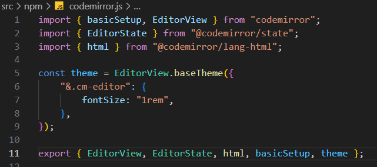
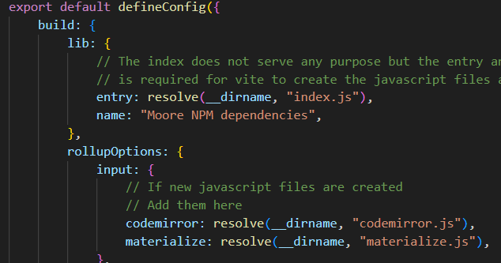
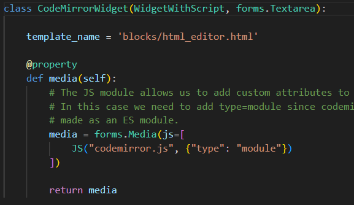
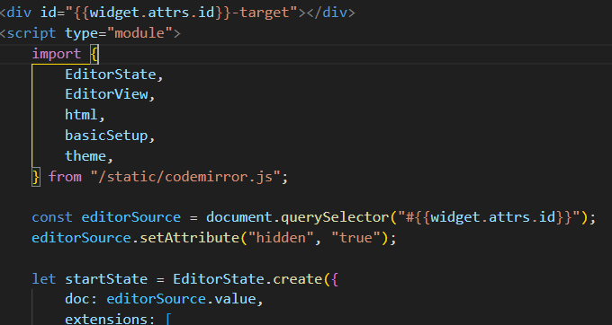

# NPM modules

This app allows the possiblity to install and use NPM modules within project moore.
Previously, JavaScript files had to be downloaded and added directly to the source code.
This makes it difficult to remember and actually update the library and is not a practice used anymore (2023).

This module allows packages to be installed via npm which is the recommended way to install javascript packages.

## How to use

The packages from npm and any other custom code that we add on top of them, do not work directly in browsers. In order to get the code to be usable by browsers, Vite is used to compile them.

1. All javascript files that should be compiled to work in browsers must be added in `vite.config.js` under `build --> rollupOptions --> input`,
2. Run `npx vite build` to compile the files. This creates a folder called `static` with the files compiled for the browser.
3. In the part of django where you want to use the javascript code, import the javascript file. How exactly you will do this depends on how you intend to use it. See examples below
4. Start the django server with `./manage.py runserver` which automatically collects the compiled javascript files from the generated static folder.

## Example

In this example we will install a javascript library called codemirror which replaces an textarea with an code editor (in this case it will be used to write HTML code) on a webpage.

1. First we install codemirror, its languages support for html and its state handler (all three of them were required for the purposes the code editor was going to be used for) `npm i codemirror @codemirror/lang-html @codemirror/state`

2. Next we create a new file called `codemirror.js` in the same directory as `vite.config.js`. In this file we import the parts of the library we want to use and create some extra code that will fit our purpose. Finally they are exported, which allows them to be used by django. **NOTE:** Only those parts that have been exported can be accessed by django!.

3. In `vite.config.js` under `build --> rollupOptions --> input`, we add codemirror so that vite will compile it.

4. We run `npx vite build` in the terminal to compile the files which creates a folder called `static` containing a file called `codemirror.js` which contains the compiled version of our original `codemirror.js` file.

5. In the CodemirrorWidget in django we first have to import the javascript file so that it can be used by django. In this case since the javascript will be used by a form widget, the javascript file can be imported in the forms media object. **Important:** The javascript has to imported with `type=module`

6. In the widgets template code, the javascript code can now be imported and used as normal javascript.

7. We run `./manage.py runserver` which automatically gets the compile javascript file since it is in a folder called static and makes it available to our code written in django.
